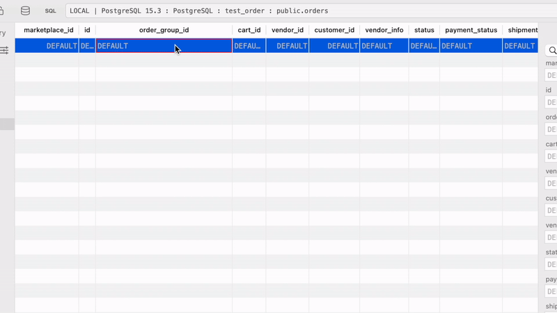

# TablePlus ULID Generator

# What is this

This is a TablePlus Plugin, you will have a menu `Generate ULID` in context menu.



# Support

TablePlus build 272 and above.

# Install

### From release

Download installable file from [release](https://github.com/arafatkn/tableplus-ulid-generator/releases), unzip and double-click on file plugin to install.

### Build from source

```
git clone git@github.com:arafatkn/tableplus-ulid-generator.git
cd tableplus-ulid-generator/ULIDGenerator.tableplusplugin
npm install
npm run build
open .
```

# How to use

1. Open a connection.
2. Open a table.
3. Click on a cell.
4. Click on `Generate ULID` in menu.

# License

ULIDGenerator is released under the MIT license. See [LICENSE](https://github.com/arafatkn/tableplus-ulid-generator/blob/master/LICENSE) for details.